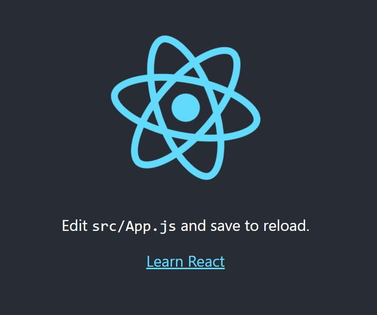

# React
## Блок 1. Встановлення
1. Скачайте та встановість https://nodejs.org/en/
2. npm install create-react-app -g (встановлюємо пакет, який дозволяє створювати нові React-додатки)
3. create-react-app --version (Перевіряємо версії)
4. create-react-app name (Створюємо новий додаток з іменем name)
5. cd name
6. npm start


В результаті виконання даних команд відкриється вікно із картинкою додатку React.js за замовченням.

## Блок 2. Прості зміни в додатку.
За замовченням, ви отримаєте додаток із наступним кодом:
```js
import logo from './logo.svg';
import './App.css';

function App() {
  return (
    <div className="App">
      <header className="App-header">
        
        <p>
          Edit <code>src/App.js</code> and save to reload.
        </p>
        <a
          className="App-link"
          href="https://reactjs.org"
          target="_blank"
          rel="noopener noreferrer"
        >
          Learn React
        </a>
      </header>
    </div>
  );
}

export default App;
```
При цьому відкриється вікно, в якому відобразиться додаток:



```js
import React from "react";

class App extends React.Component{
  render(){
    return (
      <div>
        <div>Hello</div>
      </div>
    );
  }
}

export default App;

```

## Создаем компоненты
## Создадим компонент info
1. В папке `src` создаем папку `components`
2. В папке `components` создаем файл `info.js`
```js
import React from "react";

class Info extends React.Component{
    render(){
        return(
            <div>
                <h2>Информационный заголовок</h2>
                <p>Информация</p>
            </div>
        );
    }
}
```
export default Info;

в файле `app.js` импортируем файл `info.js`:

В заголовке пишем:
```js
import Info from "./components/info"
```
в **render** ставим

`<Info />` в месте где необходимо выводить данные соответствующего компонента.

## Создадим компонент form
1. В папке `components` создадим файл `form.js`
2. В созданном файле разместим следующий текст:
```js 
import React from "react";

class Form extends React.Component{
    render(){
        return(
            <div>
                <h2>Компонент с формой</h2>
                <p>Информация</p>
            </div>
        );
    }
}

export default Form;

```


## Создадим компонент Weather

## Создадим компонент Подключим компоненты к главному компоненту

```
<form />
<info />
<Weather />
```

## Выведем результаты fetch - запроса
```js
    const api_url = await
    fetch(`http://api.openweathermap.org/data/2.5/weather?q=Kharkiv,ua&appid=58c3cca0622442647544fb302144ba06&units=metric`);
    const data =await api_url.json();

```

## Введем код в компонент Form
```js
import React from "react";

class Form extends React.Component{
    render(){
        return(
            <form onSubmit={this.props.weatherMethod}>
                <input type = "text" name="city" placeholder="Город" />
                <button>Получить погоду</button>
            </form>

        );
    }
}

export default Form;
```
