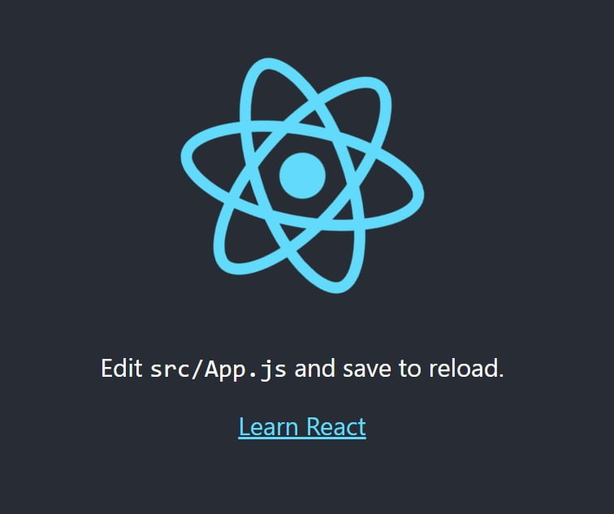
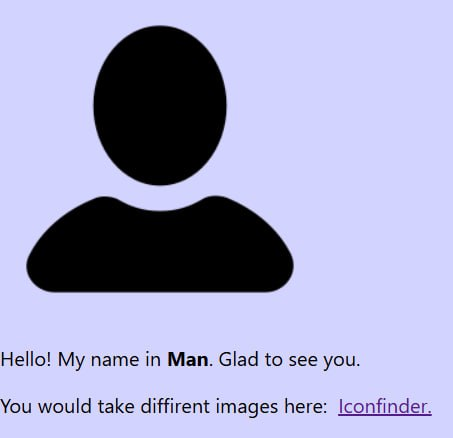

# React
## Блок 1. Встановлення
1. Скачайте та встановість https://nodejs.org/en/
2. npm install create-react-app -g (встановлюємо пакет, який дозволяє створювати нові React-додатки)
3. create-react-app --version (Перевіряємо версії)
4. create-react-app name (Створюємо новий додаток з іменем name)
5. cd name
6. npm start


В результаті виконання даних команд відкриється вікно із картинкою додатку React.js за замовченням.

## Блок 2. Прості зміни в додатку.
За замовченням, ви отримаєте додаток із наступним кодом:
```js
import logo from './logo.svg';
import './App.css';

function App() {
  return (
    <div className="App">
      <header className="App-header">
        
        <p>
          Edit <code>src/App.js</code> and save to reload.
        </p>
        <a
          className="App-link"
          href="https://reactjs.org"
          target="_blank"
          rel="noopener noreferrer"
        >
          Learn React
        </a>
      </header>
    </div>
  );
}

export default App;
```
При цьому відкриється вікно, в якому відобразиться додаток:
  


### Опис додатку.
В верхній частині коду ми бачимо імпорт двох елементів: картинки та CSS-файлу.
```js
import logo from './logo.svg';
import './App.css';
```
Тобто, якщо нам знодобляться інші картинки ми їх маємо покласти в папку із додатком та зробити їх імпорт. Так само із CSS-файлами.  
При цьому ви можете змінити існуючий файл *App.css* для зміни стилів на існуючій сторінці (в існуючому додатку).

Ми бачимо роботи функції App, яка повертає код зі певними додаваннями

#### Відображення картинки 
```js

```
Варто звернути увагу на те, що ми підставляємо в фігурних душках назву картинки, яку ми їй дали при імпорті.


## Додавання власних елементів.
Ми можемо змінити файл App.js так, як нам потрібно. Наприклад, скачати нову картинку man.png, покласти її до директорії додатку, імпортувати її та вивести в додатку. Змінити CSS-файл на style.css в якому додати одну властивість:
```css
body{
  background-color: rgba(200, 200, 255, 0.8);
}
```
В результаті, отримаємо наступний код додатку:
```js
import man from './man.png';
import './style.css';

function App() {
  return (
    <div className="App">
      <header className="App-header">
        
        <p>
         Hello! My name in <b>Man</b>. Glad to see you.
        </p>You would take diffirent images here: &nbsp; 
        <a
          className="App-link"
          href="https://www.iconfinder.com/"
          target="_blank"
          rel="noopener noreferrer"
        > 
          Iconfinder.
        </a>
      </header>
    </div>
  );
}

export default App;
```
Який відобраєаються як:  
  


## Завдання.
1. Створити власний додаток на React з нуля, змінивши картинку, CSS-файл та текст в додатку.
2. Взяти код резюме, який ви робили на минулих заняттях та вивести його у вигляді додатку на React.JS

